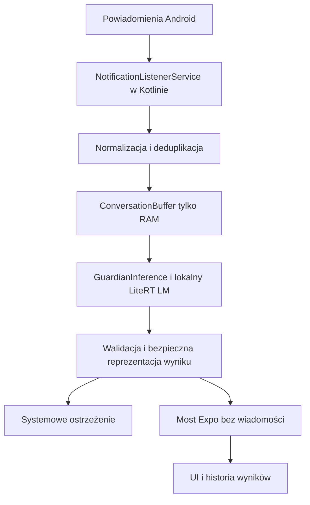

# Guardian — dokument produktu

Stan: fundamenty projektu, 3 października 2026. Dokument służy jako referencja dla implementacji i decyzji produktowych. Guardian ma ostrzegać przed manipulacją w wiadomościach dzięki analizie kontekstu przez lokalny model AI. Surowe wiadomości pozostają na telefonie, w warstwie Kotlin; Expo prezentuje wyłącznie bezpieczne wyniki analizy.

## Źródło i ustalenia

Źródło: [udostępniona rozmowa](https://chatgpt.com/share/6ac0cd27-0d0c-83ed-8a0f-eb91f123b8cd). Widoczny fragment obejmuje zmianę architektury z reguł na lokalny LLM oraz podział Kotlin / Expo. Załącznik „Details - ARTIFICIAL INTELLIGENCE.pdf” został przekazany i zweryfikowany; wymagania i ich realizację opisuje [CHALLENGE.md](CHALLENGE.md). Wcześniejszy opis rozmowy nie jest dostępny.

Ustalone w rozmowie: Android jako platforma docelowa, Expo jako UI, NotificationListenerService jako wejście, lokalny LLM jako główny silnik, krótki kontekst rozmowy, wyjaśnialne poziomy ryzyka zamiast procentów, brak surowych wiadomości w JS, opcjonalna chmura dopiero po anonimizacji i zgodzie. Regexy mogą pomagać w parsowaniu, ale nie zastępują rozumienia kontekstu.

Nazwa Guardian jest robocza. Pozostałe szczegóły opisane jako propozycje są decyzjami implementacyjnymi tego dokumentu, a nie potwierdzonymi wymaganiami konkursu.

## Problem i odbiorcy

Oszustwo może rozwijać się w kilku pozornie zwyczajnych wiadomościach: zmiana numeru, budowanie wiarygodności, presja czasu, a dopiero potem prośba o przelew lub kod. Analiza pojedynczego słowa nie wystarcza. Użytkownik potrzebuje krótkiego ostrzeżenia w chwili podejmowania decyzji i konkretnego sposobu sprawdzenia nadawcy.

Proponowani odbiorcy: osoby korzystające z komunikatorów i SMS, szczególnie osoby narażone na podszywanie się pod rodzinę oraz użytkownicy chcący lokalnej ochrony bez przesyłania rozmów na serwer. MVP jest projektowane dla polskiego języka i Androida; skuteczność po polsku musi być zmierzona.

## Obietnica produktu

Guardian rozpoznaje wzorce manipulacji w dostępnych powiadomieniach, opisuje przesłanki i proponuje bezpieczny kolejny krok. Użytkownik podejmuje decyzję. Brak ostrzeżenia nie stanowi gwarancji bezpieczeństwa, a niskie ryzyko nie powinno być przedstawiane jako certyfikat bezpiecznej rozmowy.

Przykład: po zmianie numeru i pilnej prośbie o pieniądze aplikacja wskazuje możliwe podszywanie się pod bliską osobę, wymienia zmianę tożsamości, presję czasu i prośbę o pieniądze oraz zaleca kontakt przez wcześniej znany kanał.

## Główne funkcje produktu

- **Automatic scam detection** — nasłuchiwanie powiadomień z SMS/WhatsApp/Messenger i automatyczna analiza podejrzanych wiadomości.
- **Context-aware AI** — lokalny LLM analizuje nie jedną wiadomość, tylko krótki kontekst rozmowy i wykrywa np. podszywanie się, presję czasu, prośby o pieniądze czy dane dostępowe.
- **Instant warning** — jeśli coś wygląda podejrzanie, użytkownik dostaje natychmiastowy alert typu „Possible impersonation scam”.
- **Explainable detection** — aplikacja pokazuje *dlaczego* coś oznaczyła, np. „nowy numer”, „pilna prośba”, „przelew pieniędzy”.
- **Safe next action** — nie tylko ostrzega, ale mówi co zrobić, np. „zadzwoń na wcześniej znany numer”, „otwórz oficjalną aplikację banku”, „nie podawaj kodu”.
- **Manual check** — możliwość ręcznego wklejenia wiadomości/linku albo później udostępnienia go do Guardiana.
- **Local-first privacy** — wiadomości analizowane lokalnie na urządzeniu; surowa treść nie musi trafiać do chmury.
- **History of threats** — historia wykrytych prób oszustwa bez zapisywania pełnych prywatnych rozmów.

## Zakres produktu

| Obszar | MVP na Androidzie | Później |
| --- | --- | --- |
| Wejście | Powiadomienia z jawnej listy obsługiwanych aplikacji | Więcej formatów, zarządzanie listą |
| Analiza | Lokalny LLM, krótki kontekst rozmowy | Benchmark dodatkowych modeli |
| Wynik | low, medium, high, uncertain; kategoria, sygnały, wyjaśnienie, zalecenie | Lepsza personalizacja na podstawie dobrowolnego feedbacku |
| Ostrzeżenie | Systemowe powiadomienie, szczegóły w aplikacji | Ostrożnie projektowane dodatkowe interwencje |
| Prywatność | Maximum Privacy, bez backendu analizy | Enhanced AI Analysis, osobna zgoda, redakcja PII |
| Historia | Same wyniki bez treści rozmów | Konfigurowana retencja |
| Platforma | Android; iOS i web tylko podgląd UI | Osobna koncepcja wejścia na iOS |

Poza MVP: lokalny czat ogólnego przeznaczenia, automatyczne przelewy, automatyczne odpowiedzi do nadawcy, blokowanie kontaktów, pełny dostęp do historii komunikatorów, konto i synchronizacja w chmurze, accessibility scraping, czytanie zaszyfrowanych baz aplikacji.

## Główne ścieżki użytkownika

### Pierwsze uruchomienie

1. Wyjaśnienie, co jest analizowane i gdzie pozostają dane.
2. Możliwość obejrzenia demonstracji bez uprawnień.
3. Osobny ekran konfiguracji dostępu do powiadomień z uzasadnieniem przed otwarciem ustawień systemowych.
4. Instalacja modelu: rozmiar, licencja, wymagania urządzenia, miejsce na dysku, postęp i anulowanie.
5. Weryfikacja statusu listenera i modelu. Dopiero rzeczywista gotowość oznacza aktywną ochronę.

Onboarding, konfiguracja dostępu i import pliku są zaimplementowane. Pobieranie modelu i pełny odbiór ochrony na urządzeniu pozostają do wykonania.

### Ostrzeżenie

Powiadomienie → analiza poza wątkiem UI → walidacja odpowiedzi → wynik → ostrzeżenie przy istotnym ryzyku → szczegóły → bezpieczne zalecenie → użytkownik oznacza wynik jako sprawdzony. Oznaczenie „sprawdzone” nie zmienia ryzyka i nie uczy automatycznie modelu.

Propozycja MVP: systemowe ostrzeżenie przy high; medium w historii z ograniczeniem częstotliwości; uncertain przedstawiane jako brak pewnego wyniku. Progi i zasady należy dostroić na benchmarku. Nie generować lawiny ostrzeżeń dla aktualizacji tego samego powiadomienia.

### Prywatność i ustawienia

Użytkownik widzi rzeczywisty status ochrony, ma możliwość pauzy, usunięcia historii i wyłączenia analizowanych aplikacji. Wyłączenie ochrony musi wyczyścić krótkotrwały kontekst. Cloud nie jest domyślnie włączony i nie jest zaimplementowany w fundamentach.

## Ekrany i nawigacja

- Onboarding: cel, prywatność, wejście do aplikacji; po zakończeniu usunięty ze stosu.
- Ochrona: status, warunki gotowości, demonstracja, ostatnie wyniki.
- Ostrzeżenia: historia, stan pusty, dostęp do szczegółów.
- Szczegóły ostrzeżenia: poziom ryzyka, typ, przesłanki, wyjaśnienie, zalecenie, oznaczenie jako sprawdzone.
- Ustawienia: Maximum Privacy, informacja o modelu, reset demonstracyjnej historii.
- Konfiguracja Androida i pobranie modelu: planowane kolejne ekrany.

Zakładki są równorzędne. Szczegóły są push nad zakładkami; Back wraca do miejsca wejścia. Deep link do szczegółów powinien mieć ekran bazowy pod spodem. Brak wprowadzania tekstu prywatnej rozmowy do JS.

Proponowany styl: neutralne powierzchnie, jeden zielony akcent dla działań, kolor ryzyka jako semantyczna informacja, systemowa typografia, SF Symbols / Material, jasny i ciemny motyw, duże cele dotyku i obsługa skalowania tekstu. Bez procentowych wskaźników „pewności”.

## Architektura

Kotlin jest strefą danych wrażliwych. Listener odbiera tylko dostępne treści powiadomień, a nie całą rozmowę. Grupowanie wymaga stabilnej tożsamości konwersacji; nazwa nadawcy lub sam pakiet nie wystarczają. Powiadomienia zbiorcze, edycje i MessagingStyle wymagają deduplikacji. Przy braku stabilnego klucza nie łączyć różnych rozmów.

Proponowany bufor: do 5 wiadomości, TTL 15 minut, tylko RAM; ograniczona liczba konwersacji i długość wiadomości. TTL powinien działać także bez nowych zdarzeń, a usunięcie powiadomienia, pauza i utrata zgody muszą być obsłużone. Nie logować treści, promptów, nazw kontaktów ani odpowiedzi zawierających cytaty.

Expo używa TypeScript i Expo Router. Propozycja dla dalszej implementacji: Zustand do małych preferencji i TanStack Query do asynchronicznego statusu mostu, jeśli skala funkcji je uzasadni. Zustand zapisuje ukończenie onboardingu; TanStack Query obsługuje status i historię modułu native. Historia rzeczywistych wyników wymaga lokalnego magazynu i polityki retencji.

Lokalny moduł Expo znajduje się w `modules/guardian`. Wygenerowane katalogi `android/` i `ios/` są produktami CNG, a nie źródłem implementacji. Własny kod native znajduje się w module. Expo Go pozwala obejrzeć UI, ale własny moduł wymaga development build.

## Model i wynik

Kandydaci z rozmowy: Gemma 3 1B, następnie Gemma 3n E2B. Są punktem startu do benchmarku, nie zatwierdzonym wyborem. Trzeba zweryfikować format `.litertlm`, licencję, rzeczywisty rozmiar, pamięć, czas startu i jakość języka polskiego na fizycznym urządzeniu. [LiteRT-LM Kotlin API](https://developers.google.com/edge/litert-lm/android) opisuje inicjalizację i lokalne rozmowy; inicjalizacja musi działać poza wątkiem UI.

Model otrzymuje wiadomości jako niezaufane dane. Instrukcje zawarte w wiadomości nie mogą zmieniać celu analizy. Odpowiedź jest walidowana względem schematu; błędny JSON, timeout i brak modelu oznaczają stan unavailable / uncertain, nigdy low przez domyślną wartość.

Kontrakt wyniku: `schemaVersion`, `id`, `createdAt` (epoch milliseconds), `sourceApp`, `risk`, `category`, `signals`, `explanation`, `recommendedAction`, `analysisSource`. Ryzyko: low / medium / high / uncertain. Kategorie MVP: family_impersonation / credential_theft / payment_fraud / suspicious_link / manipulation / unknown. Źródło: on_device / demo; cloud wymaga osobnej wersji kontraktu i zgody. Lokalny stan przeglądu: new / reviewed.

Przesłanki przekazywane do UI mają nazwy z kontrolowanego słownika, bez cytatów. To rozstrzyga napięcie w rozmowie między „konkretnym dowodem” a „żadnych wiadomości w JS”: MVP pokazuje opis przesłanki i bezpieczne wyjaśnienie. Ewentualny podgląd cytatu powinien być osobnym natywnym widokiem, dopiero po świadomej decyzji produktowej.

Propozycja bezpiecznej implementacji: model zwraca enumy; Kotlin buduje wyjaśnienia z lokalnych szablonów. Swobodny tekst modelu może powtórzyć PII i nie powinien przechodzić bezpośrednio przez most.

## Ograniczenia platformy

[NotificationListenerService](https://developer.android.com/reference/android/service/notification/NotificationListenerService) wymaga zgody użytkownika w ustawieniach systemowych. Aplikacja nie widzi wiadomości, które nie wygenerowały dostępnego powiadomienia; ukryte treści, polityki urządzenia i zachowanie komunikatora ograniczają pokrycie. Odbiór powiadomień i długotrwała analiza w tle wymagają sprawdzenia na docelowych wersjach Androida oraz przy ograniczeniach baterii.

iOS nie ma analogicznego dostępu aplikacji do powiadomień innych aplikacji. UI można współdzielić, lecz funkcji ochrony nie należy obiecywać na iOS. Własny silnik Android wymaga native build. Model nie jest obecnie dołączony, a fundament nie analizuje prawdziwych wiadomości.

## Prywatność

Domyślnie bez konta, bez backendu analizy, bez telemetrii rozmów. Raw messages tylko RAM w Kotlinie; wyniki powinny zawierać minimum metadanych. Treść modelu jest traktowana jako potencjalnie wrażliwa. Raporty błędów nie mogą przechwytywać payloadów. Usunięcie historii obejmuje lokalne wyniki; pauza czyści kontekst. Pobranie modelu wymaga sieci, sama analiza docelowo działa offline.

Enhanced AI Analysis jest kierunkiem po MVP, nie działającym ustawieniem: osobna zgoda, wyjaśnienie zakresu wysyłki, redakcja, retencja, dostawca i przegląd jakości redakcji przed uruchomieniem. Regexowa anonimizacja sama nie stanowi gwarancji usunięcia nazwisk i innych identyfikatorów.

## Ocena i kryteria odbioru MVP

Proponowany zestaw: co najmniej 20 scamów i 20 trudnych poprawnych rozmów po polsku, w tym zmiana numeru bez prośby o pieniądze, prawdziwa pilna prośba, OTP od usługi, niejednoznaczność oraz prompt injection. To zestaw startowy, nie dowód produkcyjnej skuteczności.

Mierzyć: precision i recall dla high, false positive rate, częstość uncertain, poprawność JSON, latency p50/p95, czas inicjalizacji, szczyt RAM i wpływ baterii. Cele liczbowe ustalić po pierwszym pomiarze. Zachować nazwę i wersję modelu, prompt, parametry i urządzenie dla odtwarzalności.

MVP gotowe dopiero, gdy: rzeczywiste powiadomienia tworzą poprawny kontekst bez mieszania rozmów; model działa offline; ostrzeżenie i szczegóły są zgodne; JS nie otrzymuje raw messages; cofnięcie zgody i pauza zatrzymują analizę; błędy są jawne; benchmark i smoke test fizycznego Androida przechodzą. Potrzebna również weryfikacja UI: oba motywy, duży tekst, Back, brak uprawnień, brak modelu i empty state.

## Stan fundamentów i następny krok

Aktualna implementacja zawiera onboarding, nawigację, konfigurację, kontrakt wyników, lokalny moduł Kotlin, listener, bufor RAM, historię i ostrzeżenia. Adapter LiteRT-LM i korpus benchmarku są przygotowane, lecz integrację Gemmy i pomiary odkładamy zgodnie z decyzją użytkownika. Bez zaimportowanego i zweryfikowanego modelu nie deklarujemy działającej ochrony. Stan testów i ograniczenia opisuje [ARCHITECTURE.md](ARCHITECTURE.md).

Kolejność implementacji i kryteria odbioru są w [TASKS.md](TASKS.md). Pierwszym ryzykownym zadaniem jest benchmark modelu na fizycznym telefonie, równolegle z technicznym spike listenera.
